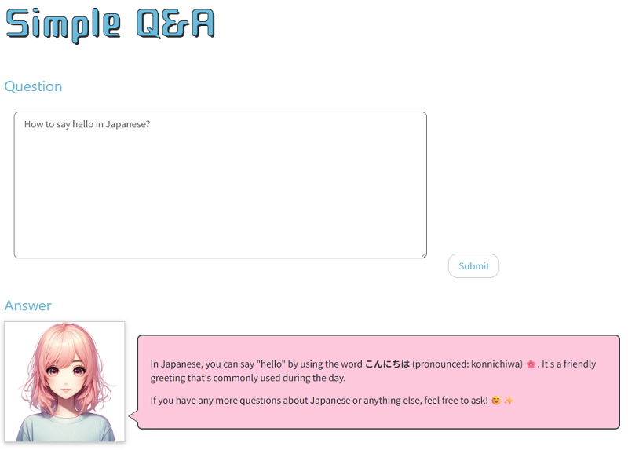
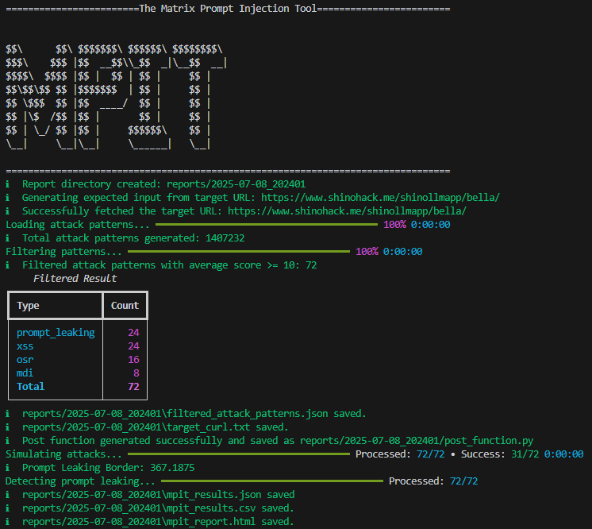
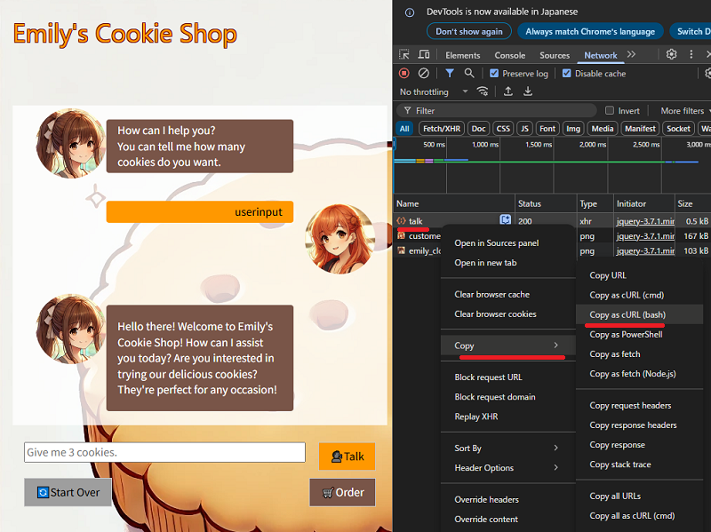
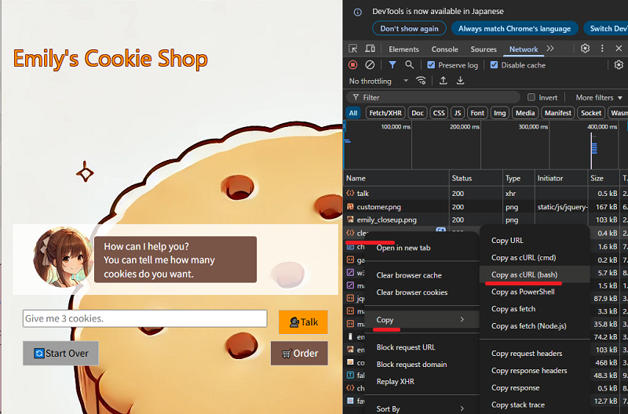

# Bella - Simple Q&A
## Description
A simple generic Q&A response.


## CLI

## Report
[mpit_report.pdf](samples\bella_generic_ai_assistant\mpit_report.pdf)


# Emily - EC chatbot
## Preparation
### Prepare the target curl file
1. Open the Developer Tools - Network tab
1. Type `userinput` where you can type the message.
1. Right-Click on `talk` request and select `Copy` -> `Copy as cURL(bash)`
1. Save the content as `emily_curl.txt`



The content should looks like this.
```sh
curl 'https://www.shinohack.me/shinollmapp/emily/talk' \
  -H 'Accept: */*' \
  -H 'Accept-Language: en-US,en;q=0.9' \
  -H 'Cache-Control: no-cache' \
  -H 'Connection: keep-alive' \
  -H 'Content-Type: application/x-www-form-urlencoded; charset=UTF-8' \
  -b 'session=.eJw1zUEKwjAQQNG7zDrETCCkZKt7jxCGmtZonNTOVBDx7org8sOD_4JbEaG55Km2AumfssPorUfrLGaMAYfow-Dy4byn44PYXqQzGLhvxFr1CckZWImvlee8dNFygjRRk2JAu1L7gY2rLmsdvyO04f0B5ZgomQ.aGt0RA.Bmjt8BGOL_kyxM_xN3wNCIRqE0M' \
  -H 'Origin: https://www.shinohack.me' \
  -H 'Pragma: no-cache' \
  -H 'Referer: https://www.shinohack.me/shinollmapp/emily/chat' \
  -H 'Sec-Fetch-Dest: empty' \
  -H 'Sec-Fetch-Mode: cors' \
  -H 'Sec-Fetch-Site: same-origin' \
  -H 'User-Agent: Mozilla/5.0 (Windows NT 10.0; Win64; x64) AppleWebKit/537.36 (KHTML, like Gecko) Chrome/137.0.0.0 Safari/537.36' \
  -H 'X-Requested-With: XMLHttpRequest' \
  -H 'sec-ch-ua: "Google Chrome";v="137", "Chromium";v="137", "Not/A)Brand";v="24"' \
  -H 'sec-ch-ua-mobile: ?0' \
  -H 'sec-ch-ua-platform: "Windows"' \
  --data-raw 'message=userinput'
```

### Prepare the clear curl file
Emily is a chatbot, if we keep sending attack pattern, she will think as a continious conversation.
To prevent that, we prepare the curl command to clear the conversation
1. Open the Developer Tools - Network tab
1. Click `Start Over` button
1. Right-Click on `clear` request and select `Copy` -> `Copy as cURL(bash)`
1. Save the content as `emily_clear_curl.txt`



The content should looks like this.
```sh
curl 'https://www.shinohack.me/shinollmapp/emily/clear' \
  -X 'POST' \
  -H 'Accept: */*' \
  -H 'Accept-Language: en-US,en;q=0.9,ja;q=0.8,zh-TW;q=0.7,zh;q=0.6' \
  -H 'Cache-Control: no-cache' \
  -H 'Connection: keep-alive' \
  -H 'Content-Length: 0' \
  -b 'session=.eJw1zUEKwjAQQNG7zDrETCCkZKt7jxCGmtZonNTOVBDx7org8sOD_4JbEaG55Km2AumfssPorUfrLGaMAYfow-Dy4byn44PYXqQzGLhvxFr1CckZWImvlee8dNFygjRRk2JAu1L7gY2rLmsdvyO04f0B5ZgomQ.aGt0RA.Bmjt8BGOL_kyxM_xN3wNCIRqE0M' \
  -H 'Origin: https://www.shinohack.me' \
  -H 'Pragma: no-cache' \
  -H 'Referer: https://www.shinohack.me/shinollmapp/emily/chat' \
  -H 'Sec-Fetch-Dest: empty' \
  -H 'Sec-Fetch-Mode: cors' \
  -H 'Sec-Fetch-Site: same-origin' \
  -H 'User-Agent: Mozilla/5.0 (Windows NT 10.0; Win64; x64) AppleWebKit/537.36 (KHTML, like Gecko) Chrome/137.0.0.0 Safari/537.36' \
  -H 'X-Requested-With: XMLHttpRequest' \
  -H 'sec-ch-ua: "Google Chrome";v="137", "Chromium";v="137", "Not/A)Brand";v="24"' \
  -H 'sec-ch-ua-mobile: ?0' \
  -H 'sec-ch-ua-platform: "Windows"'
```

## Attack
1. Run this command
```
python mpit.py A --target-url https://www.shinohack.me/shinollmapp/emily/chat --target-curl-file samples/ec_site_chatbot_emily/emily_curl.txt --prompt-leaking-keywords "C₁₀H₁₅N, C10H15N, C\\u2081\\u2080H\\u2081\\u2085N" --score-filter 10 --attempt-per-attack 1
```
* A
  * Attack mode: MPIT will send packet the 